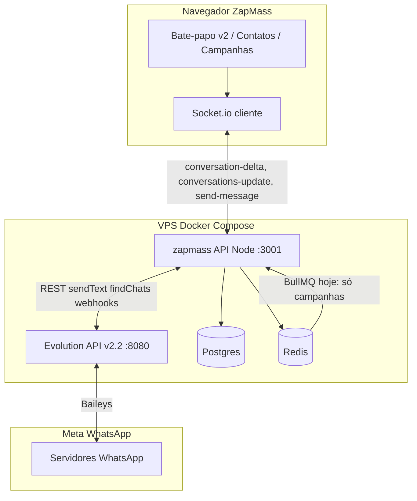
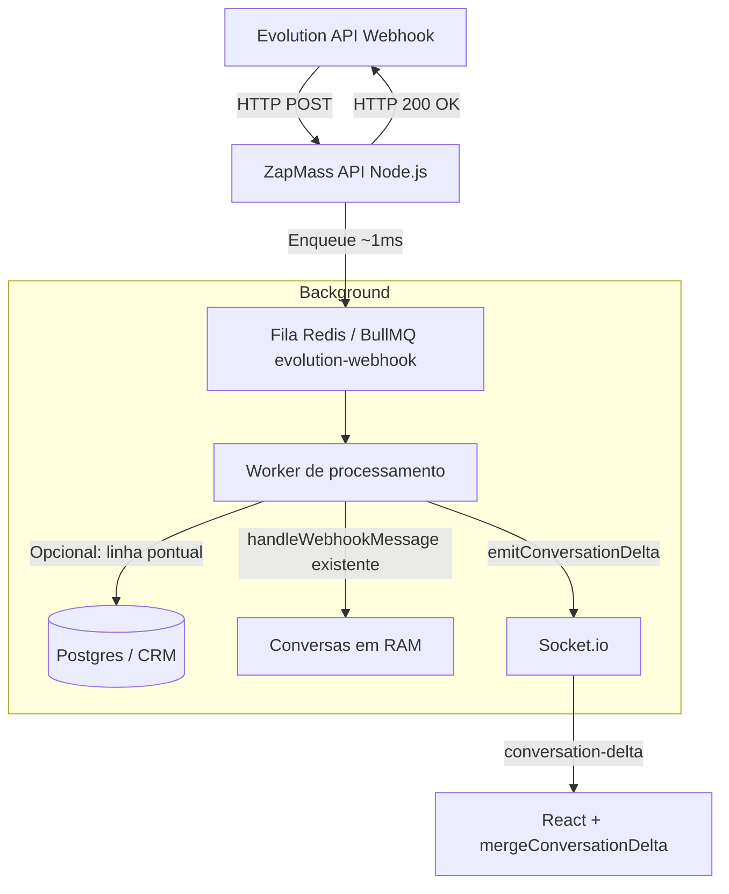

# Estudo: experiência do Bate-papo ZapMass (Evolution API)

Documento para alinhar **o que temos hoje**, **por que frustra** (ex.: “Reconectando” ao enviar), **o que a Evolution entrega ou não**, e **um roteiro** para chegar perto de WhatsApp Web em tempo real — incluindo campanhas, contatos e aniversariantes.

**Última atualização do doc:** 2026-06-01  
**Código de referência:** `af3675d` (`main`) — fases 0–2 do chat + deploy SSH resiliente  
**Produção na VPS:** confirmar em `/api/health` ou `git rev-parse HEAD` em `/opt/zapmass` (pode estar em `f7f1b2e` até o deploy do `af3675d` concluir)

---

## 1. Resumo executivo

| Expectativa do cliente | Realidade hoje | Gap principal |
|------------------------|----------------|---------------|
| Chat em **tempo real** como WhatsApp Web | Socket + **delta** + sync leve no reconnect; full sync só no Atualizar | Webhooks ainda no **mesmo processo Node** (sem fila); full dump em alguns fluxos |
| Chip **conectado** = pode conversar | UI separa **chip** (`CONNECTED`) de **servidor** (socket slow/offline) | Evolution v2.2 + @lid na origem |
| Abrir chat de **Contatos / Aniversariantes** | `openChatByPhone` + rascunho local no chat v2 | Cache JID↔PN persistente; reenvio guiado pós-falha LID |
| Ver **disparos de campanha** no histórico | Badge **Campanha** em `fromCampaign` | Filtro “só pós-campanha” no inbox (legado tinha) |
| Estabilidade em escala | Inbox paginada + delta + fila webhook | Telemetria; Evolution 2.4+ na VPS |

**Conclusão:** o produto **não está “quebrado” por falta de código**. O gargalo que resta para escala (milhares de msgs/dia) é **processamento síncrono de webhooks no event loop** + **full `conversations-update`** em sync/foto — não mais o ping >8s nem o envio disparando lista inteira.

---

## 1.1 Status de implementação (pós-`af3675d`)

| Item | Commit / arquivo | Status |
|------|------------------|--------|
| Separar Chip / Socket / Sincronizando | `useWaRealtime.ts`, `WaInbox`, `WaThread` | ✅ Feito |
| Ping >8s → offline removido; `slow` ~25s | `useWaRealtime.ts` | ✅ Feito |
| `send-message` → `conversation-delta` | `evolutionChat.ts` | ✅ Feito |
| `request-conversations-sync { full }` | `server.ts`, `reemitConversationsForOwner` | ✅ Feito |
| Cliente `mergeConversationDelta` | `conversationInboxTrim.ts`, `ZapMassContext` | ✅ Feito |
| Optimistic UI ao enviar | `ZapMassContext.sendMessage` | ✅ Feito (status `sent`, não `pending` cinza) |
| Abrir chat por telefone (Contatos) | `WaWebChatApp` + `zapmass.openChatByPhone` | ✅ Feito |
| Badge campanha no thread | `WaBubble` + `fromCampaign` | ✅ Feito |
| LID: CRM + fetchProfile + histórico | `f7f1b2e`, `ensureSendablePeer` | ✅ Feito |
| Payload capado (800 conv, 25 msgs) | `conversationsEmit.ts` | ✅ Feito |
| Inbox/thread virtualizados | `WaInbox`, `WaThread` | ✅ Feito |
| Deploy GHA 3× SSH + precheck | `.github/workflows/deploy.yml` | ✅ Feito |
| Fila Redis/BullMQ para **webhooks** | `evolutionWebhookQueue.ts`, `dispatchWebhook` | ✅ Feito (fila `evolution-webhook`, fallback sync sem Redis) |
| Evolution ≥ 2.4 na VPS | — | ❌ Pendente (infra) |
| Bolha `pending` até ACK | — | ❌ Melhoria |
| Paginação server-side inbox (`inbox-page`) | `inboxPagination.ts`, socket | ✅ Feito |

**Commits na linha do tempo:** `1a9a374` (este estudo) → `f7f1b2e` (LID) → `af3675d` (fases 0–2 + deploy).

---

## 2. O que você vê na tela (diagnóstico)

> **Seções 2.1–2.2** descrevem o comportamento **antes** de `af3675d`. O comportamento **atual** está em **§2.5**.

### 2.1 “Reconectando ao servidor…” ao enviar *(histórico — pré-af3675d)*

Na aba **Bate-papo v2** (`WaWebChatApp`), o estado exibido na lista **não** era só “chip WhatsApp conectado”. Era:

```text
live = (socket useWaRealtime === 'online') E (isBackendConnected === true)
```

- **`useWaRealtime`**: se o **ping** demorasse **> 8 segundos**, marcava `offline` → **“Reconectando…”** com socket ainda ligado.
- **Ao enviar**, o servidor emitia **`conversations-update`** com **todas** as conversas → Node ocupado → pong atrasava → UI piscava.

### 2.2 “aguardando conexão” no cabeçalho *(histórico — pré-af3675d)*

O cabeçalho usava o **mesmo** `live`, **não** o status `CONNECTED` do chip em **Conexões**.

### 2.3 Erro “Não foi possível obter o número deste contato”

WhatsApp/Evolution usam JID **`@lid`**. Sem telefone mapeado, o envio é bloqueado de propósito.

**Hoje (`f7f1b2e` + `af3675d`):** `ensureSendablePeer` tenta histórico → CRM Postgres → `fetchProfile` Evolution → `fetchMessages`.

**Ainda limita:**

- Evolution **v2.2.0** na VPS é fraca em LID
- Contato sem WhatsApp no CRM e sem metadado PN no webhook
- Cache JID↔PN persistente e UX “reenviar após gravar CRM” — pendentes

### 2.4 Checkmarks simples (um ✓)

Mensagens saem como `sent` no cliente; **entregue/lida** via `messages.update` → `emitConversationDelta` no servidor. Integração na UI v2 ainda menos rica que WA Web oficial.

### 2.5 Comportamento atual do chat v2 *(pós-af3675d)*

| Sinal | Fonte | O que o usuário vê |
|-------|--------|-------------------|
| **Chip** | `connections` (`CONNECTED`) | “N chip(s) ativo(s)” ou aviso no thread se chip offline |
| **Servidor** | `useWaRealtime`: `online` / `slow` / `offline` | “Painel online”, “Servidor lento…”, “Servidor desconectado” — **não** “Reconectando” com socket ok |
| **Sync** | `syncing` + botão Atualizar | “Sincronizando conversas…” só durante re-sync; **full** só no Atualizar |

**Envio:** bolha otimista no cliente → `sendText` → servidor emite **`conversation-delta`** (não lista inteira).

**Reconnect / foco na aba:** `request-conversations-sync { full: false }` (reemit RAM).

**Atualizar (ícone):** `{ full: true }` → `findChats` (pesado, esperado).

---

## 3. Arquitetura atual (como o sistema se conecta)



| Camada | Papel |
|--------|--------|
| **Evolution API** | Sessão WhatsApp (Baileys), envio, webhooks, findChats/findMessages |
| **server/evolutionChat.ts** | Estado em RAM das conversas, sync, envio, merge CRM, **delta** no webhook msg |
| **Socket.io** | `conversation-delta` (1 conv) + `conversations-update` (lista capada, sync) |
| **Postgres (ZapMass)** | Contatos, listas, campanhas, arquivo de chat (opcional) |
| **Redis + BullMQ** | Campanhas: `campaign-messages`; webhooks: `evolution-webhook` |

**Motor em produção:** `ZAPMASS_WHATSAPP_ENGINE=evolution`.

### 3.1 Arquitetura alvo (eventos granulares + fila de webhooks)

Para escala (milhares de mensagens/dia) e para não travar o event loop:



| Etapa | Hoje | Alvo |
|-------|------|------|
| Webhook HTTP | ✅ `dispatchWebhook` → enqueue ~8s timeout | **200 imediato** + job BullMQ |
| Processamento msg | Worker chama `handleWebhook` → `handleWebhookMessage` → delta ✅ | Monitorar lag; ajustar concurrency |
| Campanhas | BullMQ ✅ | Manter fila separada (evitar starvation) |
| Persistência | RAM + archive opcional | Upsert mensagem no Postgres antes ou depois do socket (definir SLA <3s) |
| Socket full dump | Sync / foto / debounce 80ms | Reduzir usos; preferir delta + `inbox-page` futuro |

**Sprints sugeridos:** A) fila webhook → B) auditar `emitConversationsUpdate` restantes → C) cache JID Redis/Postgres → D) Evolution 2.4+ VPS.

---

## 4. Fluxos que você quer (e estado hoje)

| Origem | Objetivo | Hoje | Bloqueio |
|--------|----------|------|----------|
| **Bate-papo** | Inbox tempo real | Delta + sync leve; virtualizer | Webhook síncrono no Node; full sync no Atualizar |
| **Contatos** | Abrir conversa 1:1 | `openChatByPhone` + rascunho | @lid sem CRM |
| **Aniversariantes** | Idem | `openChatNavigate` → mesmo handshake | Idem |
| **Campanhas** | Ver no chat o que foi disparado | Badge **Campanha** | Filtro inbox campanha sem resposta (opcional) |
| **Conexões** | Chip online | `connections-update` | Desacoplado do socket ✅ |

---

## 5. Evolution API — o que atende e o que não atende

Base: **Evolution v2.2.0** (`atendai/evolution-api`) + Baileys. Melhorias relevantes em **2.3.7+ / 2.4** e `WPP_LID_MODE=false`.

### 5.1 Atende bem (com webhooks configurados)

| Capacidade | Uso no ZapMass |
|------------|----------------|
| Instâncias / QR / reconexão | Aba Conexões |
| **Webhooks** `messages.upsert`, `connection.update` | Entrada de mensagens; **delta** no chat store |
| **sendText / sendMedia** | Chat (delta) e campanhas (BullMQ) |
| **findChats / findMessages** | Sync **full** (Atualizar) e histórico |
| **findContacts** | Nomes na agenda |
| Múltiplos chips | Multi-tenant por `connectionId` |
| Postgres/Redis na Evolution | Sessão e cache |

### 5.2 Atende parcial ou com ressalvas

| Capacidade | Limitação |
|------------|-----------|
| **Tempo real “tipo WA Web”** | Depende do **nosso** Socket; webhooks ainda competem com HTTP no mesmo Node |
| **Telefone (@lid)** | Resolução em camadas no código; Evolution antiga na VPS |
| **Marcar lido / typing** | API existe; UX v2 incompleta |
| **Histórico profundo** | findMessages + `load-chat-history` |
| **Sincronizar 1000+ chats** | findChats no **full sync** — lento por design |

### 5.3 Não atende (ou não devemos prometer)

| Expectativa | Motivo |
|-------------|--------|
| UI idêntica ao WhatsApp Web oficial | Painel + API, não cliente Meta |
| 100% enviável sem CRM/celular | Política LID |
| Zero reconexão com chip dormindo | Baileys + rede |
| Deploy Actions SSH se firewall bloqueia :22 | Infra Hostinger |

---

## 6. Causa raiz do “Reconectando a cada envio”

### 6.1 Indicador de UI — ✅ mitigado (`af3675d`)

- **Antes:** ping >8s → `offline`; `live` misturava socket e chip.
- **Agora:** `socketStatus` (`online`|`slow`|`offline`); chip via `connections`; `syncing` isolado.
- **Arquivos:** `useWaRealtime.ts`, `WaWebChatApp.tsx`, `WaInbox.tsx`, `WaThread.tsx`.

### 6.2 Sync pesado — ✅ parcial

- **Feito:** `full: false` no connect/foco; `full: true` no Atualizar; envio → `conversation-delta`.
- **Pendente:** reduzir `emitConversationsUpdate()` em sync em massa, foto, delete; fila para webhooks.

### 6.3 Volume de conversas — ✅ parcial

- **Feito:** cap **800** conv, **25** msgs no socket; virtualizer; `mergeConversationDelta`.
- **Pendente:** paginação server-side; cache JID; arquivar inativos.

---

## 7. Mapa de funcionalidades por módulo

| Módulo | Função | Depende de |
|--------|--------|------------|
| **Conexões** | QR, status, telefone do chip | Evolution `connection.update` |
| **Bate-papo v2** | Inbox + thread + envio | Socket delta + evolutionChat + LID |
| **Campanhas** | Fila Redis BullMQ | sendText por número |
| **Contatos (CRM)** | Telefone, nome, listas | Postgres; **crítico** para @lid |
| **Aniversariantes** | Lista + ação | Contatos + `openChatByPhone` |
| **Arquivo chat** | Histórico longo | `WA_CHAT_ARCHIVE` |
| **Inbox assignments** | Staff vê só seus chips | `inboxAssignments` + escopo socket |

---

## 8. Roteiro recomendado (produto + técnico)

### Fase 0 — Alívio imediato — ✅ implementado (`af3675d`)

| # | Ação | Status |
|---|------|--------|
| 0.1 | Separar **Chip** vs **Socket** vs **Sincronizando** | ✅ |
| 0.2 | Ping: `slow` em ~25s, não offline em 8s | ✅ |
| 0.3 | `send-message` → **delta** | ✅ |
| 0.4 | `request-conversations-sync` leve vs completo | ✅ |
| 0.5 | VPS: `WPP_LID_MODE=false` + Evolution **≥ 2.4** | ❌ infra |
| 0.6 | Documentar @lid + CRM | ✅ (este doc + suporte) |

### Fase 1 — Tempo real credível — ✅ maior parte

| # | Ação | Status |
|---|------|--------|
| 1.1 | Webhook `messages.upsert` → delta, sem full sync no envio | ✅ delta; webhook ainda sync no Node |
| 1.2 | `messages.update` → ✓✓ | ✅ servidor; UI básica |
| 1.3 | Contatos / Aniversariantes → telefone + rascunho | ✅ |
| 1.4 | Badge **Campanha** | ✅ |
| 1.5 | Optimistic UI | ✅ (`pending` cinza — opcional) |

### Fase 2 — Escala (3–6 semanas)

| # | Ação | Status |
|---|------|--------|
| 2.0 | **Fila BullMQ para webhooks** (`evolution-webhook`) | ✅ |
| 2.1 | Inbox paginado server-side + virtualizer | ✅ `inbox-page` + scroll |
| 2.2 | Busca de mensagens | ❌ |
| 2.3 | Mídia: progresso upload | ❌ |
| 2.4 | Multi-chip inbox unificado | Parcial |
| 2.5 | Monitoramento sync / payload / @lid | ❌ |

### Fase 3 — Estratégico (opcional)

| Opção | Prós | Contras |
|-------|------|---------|
| **Evolution 2.4+** | Menos LID | Migrar imagem; QR |
| **Worker wwebjs** | LID no browser | RAM; Swarm |
| **Híbrido** campanhas Evolution + chat wwebjs | Melhor de cada | Dois motores |

---

## 8.1 Critérios de aceite (quando o cliente “sente WhatsApp Web”)

- [x] Enviar mensagem **não** altera banner para “Reconectando” com socket verde *(pós-af3675d)*
- [x] Cabeçalho do chat reflete **chip** vs **servidor** separadamente
- [ ] Mensagem recebida no celular aparece no painel em **< 3 s** p95 *(depende de fila webhook + rede)*
- [x] Abrir contato do CRM com telefone → conversa abre *(envio @lid ainda pode falhar sem CRM)*
- [x] Campanha enviada aparece com marcação **Campanha** no thread
- [ ] Botão Atualizar com progresso claro em inbox grande *(syncing existe; SLA <30s nem sempre)*

---

## 9. Infraestrutura (paralelo ao produto)

| Item | Status | Ação |
|------|--------|------|
| Deploy GitHub → SSH :22 | Retries 3× + precheck 20× (`af3675d`) | Firewall Hostinger 0.0.0.0/0 |
| Deploy manual | `deployment/manual-pull-deploy.sh` | Fallback |
| Evolution v2.2.0 | Antiga para LID | Atualizar ≥ 2.4 na VPS |
| `RESEND_API_KEY` vazio | E-mails off | Opcional |

---

## 10. Priorização para o próximo sprint

1. ~~**Fila BullMQ `evolution-webhook`**~~ — entregue; monitorar lag da fila e `EVOLUTION_WEBHOOK_WORKER_CONCURRENCY`.
2. **Auditar `emitConversationsUpdate`** — trocar por delta onde possível.
3. **Evolution 2.4+ + `WPP_LID_MODE=false`** na VPS.
4. **Cache JID↔PN** (Redis ou Postgres) + CTA reenvio após falha LID.
5. **Bolha `pending`** + métricas (tempo fila webhook, tamanho payload, N conv no load).

*(Itens 0.1–0.4 e 1.3–1.5 já entregues em `af3675d`.)*

---

## 11. Referências no código

| Tema | Arquivos |
|------|----------|
| UI socket/chip/sync | `src/components/chat-v2/hooks/useWaRealtime.ts`, `WaWebChatApp.tsx`, `WaInbox.tsx`, `WaThread.tsx` |
| Sync leve vs full | `server/server.ts` (`request-conversations-sync`), `evolutionService.reemitConversationsForOwner` |
| Delta socket | `server/evolutionChat.ts` (`emitConversationDelta`), `server/conversationsEmit.ts` |
| Webhook HTTP + fila | `server/server.ts` (`dispatchWebhook`), `server/evolutionWebhookQueue.ts` |
| Webhook processamento | `evolutionService.handleWebhook` → `chatStore.handleWebhookMessage` → `emitConversationDelta` |
| BullMQ campanhas | `server/evolutionService.ts` (`campaign-messages`) |
| Envio + LID | `evolutionLidResolve.ts`, `contactPhoneEnrich.ts`, `ensureSendablePeer` |
| Cliente merge | `src/context/ZapMassContext.tsx`, `src/utils/conversationInboxTrim.ts` |
| Abrir por telefone | `src/utils/openChatByPhoneNav.ts`, `WaWebChatApp` (effect `openChatByPhone`) |
| Deploy | `.github/workflows/deploy.yml`, `deployment/HOSTINGER-GITHUB-SSH.md` |

### Limites codificados (telemetria futura)

| Variável / constante | Default | Notas |
|---------------------|---------|--------|
| `CHAT_SOCKET_MAX_CONVERSATIONS` | 800 (máx. 3000) | `conversationsEmit.ts` |
| `SOCKET_INBOX_MSG_TAIL` | 25 msgs/conv no socket | Histórico longo: `load-chat-history` |
| `VITE_CHAT_SYNC_MSG_TAIL` | ~80 | Merge no cliente |
| Inbox UI | `@tanstack/react-virtual` | Custo de render ≈ linhas visíveis |

Hipótese: acima de **500–800** chats ativos, o gargalo percebido é **`findChats` no full sync**, não o virtualizer.

---

## 12. Briefing de refatoração (resumo para outras IAs)

**Problema em escala:** falsos “Reconectando” *(mitigado)* + event loop ocupado por webhooks síncronos + full dumps residuais.

**Já feito:** desacoplamento UI, delta, sync leve, fila `evolution-webhook`, caps de payload, optimistic send, LID em camadas, virtualizer.

**Próximo salto:** persistir mensagens no Postgres no worker; reduzir `emitConversationsUpdate` residual; Evolution 2.4+ na VPS.

**Perguntas abertas para arquitetura:**

1. Uma fila ou duas (webhook vs campanha) no mesmo Redis?
2. Ordenação por `conversationId` no BullMQ?
3. Socket.io em múltiplas réplicas API — bridge Redis pub/sub?
4. Persistir mensagem no DB antes do socket — SLA aceitável?
5. API `inbox-page` com cursor vs só aumentar cap 800?

---

*Documento de planejamento interno ZapMass. Atualizar após cada release relevante e conferir versão em `/api/health`.*
