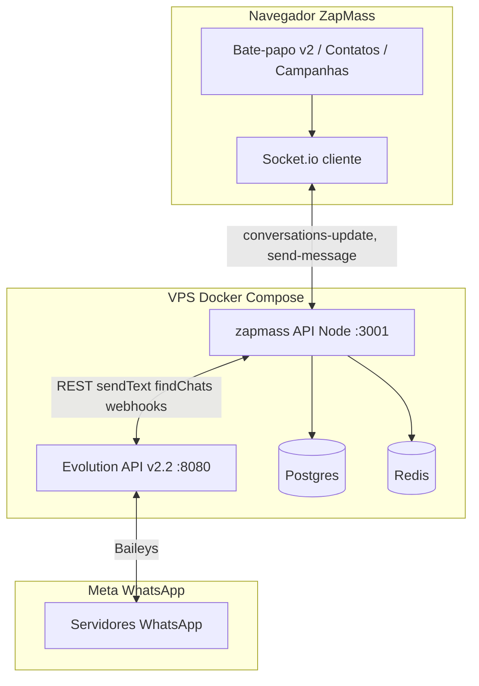

# Estudo: experiência do Bate-papo ZapMass (Evolution API)

Documento para alinhar **o que temos hoje**, **por que frustra** (ex.: “Reconectando” ao enviar), **o que a Evolution entrega ou não**, e **um roteiro** para chegar perto de WhatsApp Web em tempo real — incluindo campanhas, contatos e aniversariantes.

**Versão em produção referida:** `f7f1b2e` (Evolution + monólito Docker Compose).

---

## 1. Resumo executivo

| Expectativa do cliente | Realidade hoje | Gap principal |
|------------------------|----------------|---------------|
| Chat em **tempo real** como WhatsApp Web | Atualizações via **Socket.io** + sincronizações **pesadas** (findChats) | Latência e “falsos offline” |
| Chip **conectado** = pode conversar | UI do chat usa outro sinal (`live` = socket + ping) | “aguardando conexão” com chip verde |
| Abrir chat de **Contatos / Aniversariantes** | Parcial (`openChatByConversationIdNav`) | Falta número/JID estável (@lid) |
| Ver **disparos de campanha** no histórico | `fromCampaign` existe no modelo | Nem sempre visível / merge fraco |
| Estabilidade em escala | Inbox com milhares de conversas + sync completo | Event loop e payload enormes |

**Conclusão:** o produto **não está “quebrado” no sentido de ausência de código**, mas a **arquitetura de sincronização + indicadores de UI** foi desenhada para “atualizar a lista inteira” e punir latência com o rótulo “Reconectando”. Isso destrói a percepção de tempo real.

---

## 2. O que você vê na tela (diagnóstico)

### 2.1 “Reconectando ao servidor…” ao enviar

Na aba **Bate-papo v2** (`WaWebChatApp`), o estado exibido na lista **não** é só “chip WhatsApp conectado”. É:

```text
live = (socket useWaRealtime === 'online') E (isBackendConnected === true)
```

- **`useWaRealtime`**: se o **ping** Socket (`ping-latency` / `pong-latency`) demorar **> 8 segundos**, marca `offline` → texto **“Reconectando ao servidor…”** mesmo com socket ainda ligado.
- **`isBackendConnected`**: cai para `false` ~3s após `disconnect` (troca de aba, queda breve, servidor ocupado).

**Ao enviar mensagem**, o servidor:

1. Chama Evolution `sendText`
2. Atualiza conversa em memória
3. Emite **`conversations-update`** com **todas** as conversas (payload enxuto, mas ainda grande em bases grandes)
4. O Node pode ficar ocupado serializando/enviando → **pong atrasa** → UI pisca **Reconectando**

Ou seja: muitas vezes **não é queda real de conexão** — é **indicador agressivo** + servidor ocupado.

### 2.2 “aguardando conexão” no cabeçalho do chat (Gabriel)

O cabeçalho usa o **mesmo** `live` acima, **não** o status `CONNECTED` do chip em **Conexões**.

Por isso: chip **online** na aba Conexões e, no chat, **“aguardando conexão”** ao mesmo tempo.

### 2.3 Erro “Não foi possível obter o número deste contato”

WhatsApp/Evolution passou a usar JID **`@lid`** (privacidade). Sem telefone mapeado (`senderPn`, CRM, histórico), o envio é bloqueado de propósito (Evolution `sendText` com número errado → 400).

Correções em `f7f1b2e` (CRM, histórico, fetchProfile) **ajudam**, mas:

- Evolution **v2.2.0** na VPS ainda é **fraca** em LID
- Contato precisa estar no **CRM** ou ter mensagem com metadado PN

### 2.4 Checkmarks simples (um ✓)

Mensagens saem como `sent` no cliente; confirmação **entregue/lida** depende de webhooks `messages.update` e estado local — menos rico que WhatsApp Web.

---

## 3. Arquitetura atual (como o sistema se conecta)



| Camada | Papel |
|--------|--------|
| **Evolution API** | Sessão WhatsApp (Baileys), envio, webhooks, findChats/findMessages |
| **server/evolutionChat.ts** | Estado em RAM das conversas, sync, envio, merge CRM |
| **Socket.io** | Empurra lista de conversas + erros de envio |
| **Postgres (ZapMass)** | Contatos, listas, campanhas, arquivo de chat (opcional) |
| **Firestore/arquivo** | `WA_CHAT_ARCHIVE` — histórico persistido |

**Motor em produção:** `ZAPMASS_WHATSAPP_ENGINE=evolution` (não whatsapp-web.js no container principal).

---

## 4. Fluxos que você quer (e estado hoje)

| Origem | Objetivo | Hoje | Bloqueio |
|--------|----------|------|----------|
| **Bate-papo** | Inbox tempo real | Lista via sync + socket | Sync pesado; falsos “offline” |
| **Contatos** | Abrir conversa 1:1 | Navegação por `conversationId` | Sem JID/telefone → @lid |
| **Aniversariantes** | Idem | Similar a contatos | Idem |
| **Campanhas** | Ver no chat o que foi disparado | Flag `fromCampaign` / funil | Thread nem sempre mostra contexto de campanha |
| **Conexões** | Chip online | Evolution `open` + webhook | Desacoplado do indicador do chat |

---

## 5. Evolution API — o que atende e o que não atende

Base: **Evolution v2.2.0** (`atendai/evolution-api`) + Baileys. Comunidade reporta melhorias relevantes em **2.3.7+ / 2.4** e `WPP_LID_MODE=false`.

### 5.1 Atende bem (com webhooks configurados)

| Capacidade | Uso no ZapMass |
|------------|----------------|
| Instâncias / QR / reconexão | Aba Conexões |
| **Webhooks** `messages.upsert`, `connection.update` | Entrada de mensagens e status de chip |
| **sendText / sendMedia** | Chat e campanhas (fila Redis) |
| **findChats / findMessages** | Sync inicial e “Atualizar lista” |
| **findContacts** | Nomes na agenda |
| Múltiplos chips (instâncias) | Multi-tenant por `connectionId` |
| Postgres/Redis na Evolution | Sessão e cache |

### 5.2 Atende parcial ou com ressalvas

| Capacidade | Limitação |
|------------|-----------|
| **Tempo real “tipo WA Web”** | Não há stream nativo para o front; depende do **nosso** Socket + tamanho do payload |
| **Telefone do contato (@lid)** | Nem sempre vem no webhook; sendText exige **número real** |
| **Marcar lido / typing / presença** | Endpoints existem; integração incompleta na UI v2 |
| **Histórico profundo** | findMessages paginado; custo alto; usamos tail + arquivo |
| **Grupos** | Suportado na API; UX do produto foca 1:1 |
| **Sincronizar 1000+ chats** | findChats paginado — **lento**; trava sensação de realtime |

### 5.3 Não atende (ou não devemos prometer)

| Expectativa | Motivo |
|-------------|--------|
| UI idêntica ao WhatsApp Web oficial | Somos camada **API + painel**, não cliente Meta |
| 100% dos contatos enviáveis sem CRM/celular | Política LID do WhatsApp |
| Zero reconexão com chip dormindo | Sessão Baileys exige manutenção (versão WA, rede, Evolution) |
| Deploy Actions SSH se firewall bloqueia :22 | Infra Hostinger ≠ bug do chat |

---

## 6. Causa raiz do “Reconectando a cada envio”

### 6.1 Indicador de UI (rápido de corrigir)

- Arquivo: `src/components/chat-v2/hooks/useWaRealtime.ts` — linha que põe `offline` se ping **> 8000 ms**.
- Arquivo: `WaWebChatApp.tsx` — `live` mistura socket com chip.

**Direção:** três estados visíveis:

1. **Servidor** (Socket) — verde / amarelo / vermelho  
2. **Chip WhatsApp** — `CONNECTED` da aba Conexões  
3. **Sincronizando** — só durante `request-conversations-sync` explícito (botão Atualizar)

Não usar “Reconectando” quando o socket ainda está `connected`.

### 6.2 Sync pesado no “Atualizar” e ao focar aba

`request-conversations-sync` no servidor chama, para Evolution:

```text
syncConnectionsForOwner → syncChatsForConnection (findChats paginado) POR chip aberto
```

Isso é **O(número de chats)** na API Evolution — **não** é incremental.

`useWaRealtime` chama `onResync()` no **connect** → dispara sync completo ao reconectar socket (troca de aba, refresh).

**Direção:**

- Endpoint **leve**: reemitir estado RAM + deltas, sem findChats.
- Sync completo só no botão **Atualizar** ou cron (já existe janela no deploy).
- Após **send-message**: emitir só **uma conversa** alterada (`conversation-delta`), não lista inteira.

### 6.3 Volume de conversas na RAM

Com `WA_FULL_INBOX_SYNC=1`, inbox puxa muitos chats (incl. números internacionais / LID na lista). Cada `conversations-update` percorre o cliente inteiro (`mergeConversationsFromSocketUpdate`).

**Direção:** paginação de inbox, arquivar chats inativos, limitar sync inicial (ex.: últimos 90 dias / top 500).

---

## 7. Mapa de funcionalidades por módulo

| Módulo | Função | Depende de |
|--------|--------|------------|
| **Conexões** | QR, status, telefone do chip | Evolution `connection.update` |
| **Bate-papo v2** | Inbox + thread + envio | Socket + evolutionChat + LID resolve |
| **Campanhas** | Fila Redis, disparo em massa | sendText por número; não abre thread automaticamente |
| **Contatos (CRM)** | Telefone, nome, listas | Postgres; **crítico** para @lid |
| **Aniversariantes** | Lista + ação | Contatos + data |
| **Arquivo chat** | Histórico longo | `WA_CHAT_ARCHIVE` + Postgres/Firestore |
| **Inbox assignments** | Staff vê só seus chips | `inboxAssignments` + escopo socket |

---

## 8. Roteiro recomendado (produto + técnico)

### Fase 0 — Alívio imediato (1–3 dias) — “parar de passar raiva”

| # | Ação | Impacto |
|---|------|---------|
| 0.1 | Separar indicadores: **Chip** vs **Socket** vs **Sincronizando** | Elimina “aguardando conexão” falso |
| 0.2 | Remover ou relaxar ping **>8s → offline**; usar “lento” opcional | Para de piscar ao enviar |
| 0.3 | `send-message` → emit **delta** (1 conversa) | Menos carga; menos pong atrasado |
| 0.4 | `request-conversations-sync` **leve** vs **completo** (flag) | Atualizar sem findChats sempre |
| 0.5 | VPS: `WPP_LID_MODE=false` + planejar Evolution **≥ 2.4** | Menos @lid na origem |
| 0.6 | Documentar: contato @lid precisa **WhatsApp no CRM** | Suporte / onboarding |

### Fase 1 — Tempo real credível (1–2 semanas)

| # | Ação |
|---|------|
| 1.1 | Webhook `messages.upsert` → append mensagem + patch conversa (já parcial) — **garantir** sem full sync |
| 1.2 | Webhook `messages.update` → ✓✓ / lido no bubble |
| 1.3 | Abrir chat unificado: Contatos / Aniversariantes → `conversationId` + criar conversa se não existir (com telefone CRM) |
| 1.4 | Badge “Campanha” / filtro “só respostas pós-campanha” no thread |
| 1.5 | Optimistic UI: mostrar bolha ao enviar antes do ACK |

### Fase 2 — Escala e experiência WA-like (3–6 semanas)

| # | Ação |
|---|------|
| 2.1 | Inbox paginado virtualizado + “carregar mais” server-side |
| 2.2 | Busca de mensagens (índice ou Evolution search se disponível) |
| 2.3 | Mídia: progresso de upload; thumbnail estável |
| 2.4 | Multi-chip: inbox unificado ou por chip com troca clara |
| 2.5 | Monitoramento: tempo de sync, tamanho payload, taxa @lid |

### Fase 3 — Estratégico (opcional)

| Opção | Prós | Contras |
|-------|------|---------|
| **Evolution 2.4+** mantendo stack | Menos LID; comunidade ativa | Migrar imagem; retestar QR |
| **Worker wwebjs** (`SESSION_PROCESS_MODE=api`) | Controle Puppeteer; LID tools no browser | RAM; complexidade Swarm |
| **Híbrido** campanhas Evolution + chat wwebjs | Melhor de cada | Dois motores |

---

## 8.1 Critérios de aceite (quando o cliente “sente WhatsApp Web”)

- [ ] Enviar mensagem **não** altera banner para “Reconectando” com socket verde  
- [ ] Cabeçalho do chat mostra **Chip conectado** quando Conexões está `CONNECTED`  
- [ ] Mensagem recebida no celular aparece no painel em **< 3 s** (webhook + socket)  
- [ ] Abrir contato do CRM com telefone → conversa abre e **envia** na primeira tentativa  
- [ ] Campanha enviada aparece no histórico com marcação identificável  
- [ ] Botão Atualizar completa em tempo aceitável (< 30 s para inbox típico) ou mostra progresso  

---

## 9. Infraestrutura (paralelo ao produto)

| Item | Status | Ação |
|------|--------|------|
| Deploy GitHub → SSH :22 | Timeout intermitente | Firewall Hostinger 0.0.0.0/0; ou runner self-hosted |
| Deploy manual | Funciona (`manual-pull-deploy.sh`) | OK até CI estabilizar |
| Evolution v2.2.0 | Antiga para LID | Atualizar imagem + `CONFIG_SESSION_PHONE_VERSION` |
| `RESEND_API_KEY` vazio | E-mails off | Opcional |

---

## 10. Priorização sugerida para o próximo sprint

1. **Fase 0.1 + 0.2 + 0.3** (UI + delta socket) — maior ganho percebido com menor risco.  
2. **Evolution upgrade + WPP_LID_MODE** na VPS — reduz @lid na raiz.  
3. **Fase 1.3** — abrir chat de Contatos/Aniversariantes com telefone CRM.  
4. **Fase 1.4** — visibilidade de campanhas no thread.  

---

## 11. Referências no código

| Tema | Arquivos |
|------|----------|
| UI “Reconectando” | `src/components/chat-v2/hooks/useWaRealtime.ts`, `WaWebChatApp.tsx`, `WaInbox.tsx`, `WaThread.tsx` |
| Sync pesado | `server/server.ts` (`request-conversations-sync`), `evolutionService.syncConnectionsForOwner` |
| Envio + LID | `server/evolutionChat.ts`, `evolutionLidResolve.ts`, `contactPhoneEnrich.ts` |
| Socket merge | `src/context/ZapMassContext.tsx`, `conversationInboxTrim.ts` |
| Payload socket | `server/conversationsEmit.ts` (`SOCKET_INBOX_MSG_TAIL = 25`) |
| Deploy / Evolution | `docker-compose.yml`, `deployment/HOSTINGER-GITHUB-SSH.md` |

---

*Documento gerado para planejamento interno ZapMass. Atualizar conforme commits e versão em `/api/health`.*
