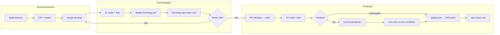

# Fluxo de melhorias ZapMass (develop → homolog → produção)

Como aplicar mudanças no sistema **sem derrubar chips de clientes** em horário comercial.

## Visão geral

| Ambiente | URL | Branch Git | Quando sobe na VPS |
|----------|-----|------------|-------------------|
| **Homologação** | https://homolog.zap-mass.com | `develop` | Push em `develop` (qualquer hora) |
| **Produção** | https://zap-mass.com | `main` | Madrugada BRT **02:00–05:59** ou **Run workflow** manual |

Homolog e produção **não compartilham** chips WhatsApp nem banco de dados de negócio (Postgres/Redis isolados). Testar em homolog **nunca** reconecta chips de clientes.

---

## Diagrama do fluxo



---

## Passo a passo (rotina)

### 1. Desenvolver

```bash
git checkout develop
git pull origin develop
git checkout -b feature/minha-melhoria
# ... código, typecheck, testes locais ...
git push -u origin feature/minha-melhoria
```

Abrir **PR** `feature/*` → `develop`. CI roda typecheck + testes.

### 2. Validar em homolog

Após merge em `develop`:

1. GitHub Actions → **Deploy homolog (develop)** — deve ficar verde
2. Confirmar versão:
   ```bash
   curl -s https://homolog.zap-mass.com/api/health
   # "environment":"homolog" · "version":"<commit>"
   ```
3. Testar manualmente no painel (faixa laranja “homolog”)
4. Chip de **teste** apenas — nunca chip de cliente

**Deploy manual na VPS** (se CI/SSH falhar):

```bash
cd /opt/zapmass
git fetch origin develop
git checkout develop && git pull origin develop
bash deployment/vps-deploy-homolog.sh
```

### 3. Promover para produção

Quando homolog estiver OK:

1. Abrir **PR** `develop` → `main`
2. Revisar checklist (abaixo)
3. Merge em `main`

**O que acontece no merge:**

| Horário (BRT) | Push em `main` |
|---------------|----------------|
| **Dia** (06:00–01:59) | Só **build + testes** — VPS prod **não reinicia** |
| **Madrugada** (02:00–05:59) | Build + **deploy automático** na VPS |
| **Qualquer hora** | **Actions → Build + deploy VPS → Run workflow** = deploy imediato |

Commits do dia ficam **pendentes** até o cron da madrugada (a cada 30 min entre 02:00 e 05:59 BRT).

### 4. Confirmar produção

```bash
curl -s https://zap-mass.com/api/health
# version = commit esperado · environment ≠ homolog
```

Na VPS:

```bash
cd /opt/zapmass && bash deployment/ensure-git-main.sh && git log -1 --oneline
bash deployment/verify-prod.sh   # se existir
```

---

## Checklist antes de `develop` → `main`

Copie no PR de produção:

- [ ] CI verde em `develop` (typecheck + testes)
- [ ] Homolog em https://homolog.zap-mass.com com a versão do PR
- [ ] Fluxo testado manualmente (login, campanha, inbox — o que a feature tocar)
- [ ] Chip de teste conectou/desconectou em homolog sem erro
- [ ] Migration Postgres testada em homolog (se houver)
- [ ] Nenhum token `APP_USR-` / segredo de prod no `homolog/.env`
- [ ] Comunicado à equipe se deploy prod for **manual** em horário comercial

---

## Proteções pós-deploy (produção)

Implementadas para evitar queda em massa de chips:

| Mecanismo | O que faz |
|-----------|-----------|
| **Janela 02–06h BRT** | Push diurno em `main` não reinicia API prod |
| **Sem `--force-recreate`** | `vps-deploy.sh` atualiza container sem recriar à força |
| **Graça 10 min** | Após restart, API tolera chips reconectando (`shared/deployGrace.ts`) |
| **Campanhas +5 min** | Campanhas RUNNING só retomam após 5 min de uptime |
| **Reconnect sequencial** | Fila com intervalo entre `/instance/connect` |
| **Homolog isolado** | Deploy homolog **nunca** executa `vps-deploy.sh` de prod |

---

## Tipos de mudança

### Feature / melhoria normal

`feature/*` → `develop` → homolog → PR → `main` → madrugada.

### Correção urgente (hotfix)

```bash
git checkout main && git pull
git checkout -b hotfix/descricao-curta
# fix mínimo
git push -u origin hotfix/descricao-curta
```

1. PR `hotfix/*` → `main` (deploy prod: **Run workflow** ou esperar madrugada)
2. PR `hotfix/*` → `develop` (ou merge `main` em `develop` depois) — manter branches alinhadas

### Só infra / scripts de deploy

Arquivos em `deployment/**` disparam CI. Teste homolog primeiro se o script também afetar prod (ex.: Postgres compartilhado).

### Migration de banco

1. Migration idempotente ou script documentado
2. Rodar/testar em **homolog** (`zapmass_homolog`)
3. Em prod: migration roda no boot da API ou script manual na VPS **antes** do deploy, conforme README da migration

---

## Responsabilidades (sugerido)

| Papel | Ação |
|-------|------|
| **Dev** | Branch, PR, testes locais |
| **Revisor** | PR develop + checklist homolog |
| **Operador** | Merge `main`, Run workflow se urgente, monitorar `/api/health` e chips |
| **Todos** | Nunca testar chip de cliente em homolog |

---

## Comandos rápidos

| Situação | Comando |
|----------|---------|
| Alinhar VPS com `main` | `bash deployment/ensure-git-main.sh` |
| Deploy homolog manual | `bash deployment/vps-deploy-homolog.sh` |
| Deploy prod manual (fora da janela) | GitHub **Run workflow** ou `DEPLOY_FORCE=1 bash deployment/manual-pull-deploy.sh` |
| Evolution homolog com problema | `bash deployment/recover-homolog-evolution-go.sh` |
| Postgres sem conexões | `bash deployment/fix-postgres-connections.sh` |
| Health homolog | `curl -s https://homolog.zap-mass.com/api/health` |
| Health prod | `curl -s https://zap-mass.com/api/health` |

---

## Workflows GitHub

| Workflow | Branch | Deploy VPS |
|----------|--------|------------|
| `deploy.yml` | `main` | Prod — madrugada ou manual |
| `deploy-homolog.yml` | `develop` | Homolog — imediato |

---

## FAQ

**Mergei em `main` de dia e nada mudou em zap-mass.com**  
Esperado. Push diurno só valida build. Aguarde madrugada ou use **Run workflow**.

**Homolog atualizou mas prod não**  
Normal — branches diferentes. Prod só segue `main`.

**Posso commitar direto em `main`?**  
Evite. Use `develop` + homolog + PR. Hotfix é exceção.

**Deploy homolog derruba produção?**  
Não. Scripts e compose são separados (`vps-deploy-homolog.sh` / `docker-compose.homolog.yml`).

---

## Documentos relacionados

- [HOMOLOGACAO.md](./HOMOLOGACAO.md) — setup e troubleshooting homolog
- [TUTORIAL-PROTECAO-CHIPS.md](./TUTORIAL-PROTECAO-CHIPS.md) — boas práticas WhatsApp
- `deployment/deploy-window.sh` — lógica da janela madrugada na VPS
